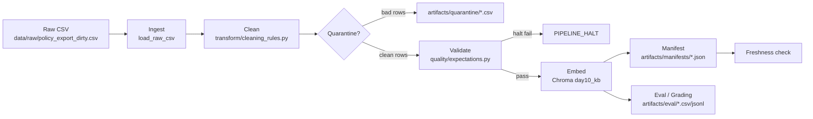

# Kiến trúc pipeline - Lab Day 10

**Nhóm:** Day10 Lab Team  
**Cập nhật:** 2026-06-10  
**Run sạch cuối:** `2026-06-10T08-20Z`

---

## 1. Sơ đồ luồng

Điểm đo chính:

- `run_id`: sinh ở đầu pipeline và ghi vào manifest.
- `raw_records`, `cleaned_records`, `quarantine_records`: in ra log và ghi manifest.
- Freshness: đo sau publish bằng `latest_exported_at` trong manifest.
- Quality evidence: `after_inject_bad.csv`, `after_fix_eval.csv`, `grading_run.jsonl`.

---

## 2. Ranh giới trách nhiệm

| Thành phần | Input | Output | Owner nhóm |
|------------|-------|--------|------------|
| Ingest | `data/raw/policy_export_dirty.csv` | raw rows, `raw_records=247` | Ingestion Owner |
| Transform | raw rows + allowlist | cleaned rows + quarantine rows | Cleaning / Quality Owner |
| Quality | cleaned rows | expectation results, halt/warn decision | Cleaning / Quality Owner |
| Embed | cleaned CSV | Chroma collection `day10_kb` | Embed Owner |
| Monitor | manifest | freshness PASS/WARN/FAIL | Monitoring / Docs Owner |
| Eval | Chroma collection + questions JSON | CSV/JSONL evidence | Embed Owner |

---

## 3. Idempotency & rerun

Pipeline dùng `chunk_id` ổn định từ `doc_id`, `chunk_text` đã clean, và sequence. Khi rerun, Chroma upsert theo id và prune vector không còn trong cleaned snapshot. Run sạch cuối ghi:

- `cleaned_records=37`
- `quarantine_records=210`
- `embed_upsert count=37`
- `embed_prune_removed=2`

Điều này chứng minh rerun sau inject đã đưa collection về trạng thái sạch, không giữ lại vector stale từ bản `inject-bad`.

---

## 4. Liên hệ Day 09

Day 09 cần retrieval worker dùng corpus đúng version. Day 10 đảm bảo corpus đó sạch trước khi agent đọc: refund dùng 7 ngày, HR dùng chính sách 2026, SLA P1 có escalation 10 phút, và access control SOP được đưa vào index. Collection `day10_kb` có thể đóng vai trò nguồn tri thức mới cho retrieval worker của Day 09.

---

## 5. Rủi ro đã biết

- Freshness hiện `FAIL` vì data mẫu có `latest_exported_at=2026-04-11T00:00:00`, cũ hơn SLA 24 giờ so với run ngày 2026-06-10.
- `q_p1_update_frequency` trong eval mở rộng có top-1 là `it_helpdesk_faq`, dù top-k vẫn chứa expected answer. Grading chính thức 10 câu không fail.
- Pipeline vẫn dùng custom expectation thay vì Great Expectations; đủ cho lab nhưng có thể nâng cấp để validate schema mạnh hơn.
